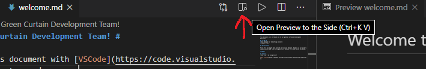

# Welcome to the Green Curtain Development Team! #

It's easiest to read this document with [VSCode](https://code.visualstudio.com/), which you're going to need anyway.

This document will introduce you to our general software development practices.

## TL;DR ##
* Use Keybase for everything possible
* Commit often

## Specific Guides ##

* [Front-end](frontend.md)
* API - **TODO**
* Backend - **TODO**

## Workflow ##

First off, you might have noticed we're using Keybase. Keybase is our primary communications and file-sharing platform because it is end-to-end encrypted. Oh, and it's free.

For now, we're sticking with GitHub because it's free. It's also convenient that the tools we use are also based on GitHub (mainly [NativeScript](https://github.com/NativeScript)).

## Security Practices ##

TLS is a weak guarantee of data security. If the data is at all sensitive, another layer of encryption should be used.

## FAQ ##
> Why aren't we using Slack?

[This article](https://keybase.io/blog/slack-incident) pretty much summarizes it.

> Is our code really safe on GitHub?

Hard to say. Our current setup is not preferable, though, since at the least our code is being transferred with only TLS encryption. (This is an example where relying on TLS is a **bad idea**).

> What about Keybase encrypted git repos?

Well, they're awesome, but it helps to have a GUI interface for diffs and PRs. There's lots of potential software like GitLab, if only something could be used with Keybase repos...